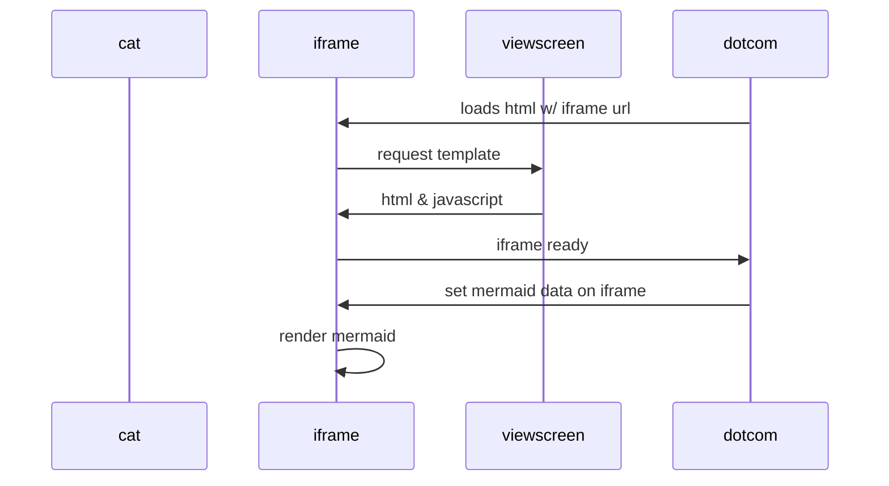

                                                   PRINTF

This project creates our own version of printf from the standard library. This is a group project from HolbertonSchool training


## Description
Printf instruction allows you to display on the screen the value of a variable, a label, the value of an expression, a character string, and this in various formats


## Charactère

| Charactère | description |  exemple
| --------| -----------|------
|%c|print a single character | H
|%i et %d | print an int convert to decimal | 9
|%%|print a percent sign| %
|%s|print a string of characters| HOLBERTON
|%f|print a floating-point number| 9,8
=======
Readme for printf
=======
____________________________________________________________________________
**README**

for

**p r i n t f  ( )  f u n c t i o n  -  formatted output**
____________________________________________________________________________

**![_printf]**(C:/Users/Thonon Student 01/OneDrive/Bureau/Holberton School Thonon - Ph. M/keep-calm-and-carry-on-1368463748qW4)

**DESCRIPTION**

The **_printf() function** produce output according to a format as described below. Also, write output to stdout, the standard output stream.

The **_printf() function** write the output under the controol of a format string that specifies, how subsequent arguments, or arguments accessed via the varaible-lenght argument facilities of stdarg are converted for output.

**FORMAT OF THE FORMAT STRING**

The format string is a character string, beginning and ending inits initial shift state, if any. The format string is composed of zero or more directives: ordinary characters, not %, which are copied unchanged to the output stream; and vonversion specifications, each of which results in fetching zero or more subsequent arguments. Each conversion specification is introduced by the character % and ends with conversion specifier.

**CONVERSION SPECIFIERS**

A character that specifies the type of conversion to be applied. The conversion specifiers and their meaning are:

**d, i**
The int argument should be signed decimal notation, and the resulting number is written.

**c**
The int argument is converted to a char, and the resulting character is written.

**s**
The const char * argument is expected to be a pointer to an array of character type (pointer to a string). Characters from the array are written up to (but not including) a terminating null byte ('\0').

**%**
A '%' is written. No argument is converted. The complete conversion specification is '%%'.

About Functions:

**int _write(char c)**
This function gets a char parameter and writes the parameter to the stdout, the standard output stream.

**int _print_a_char (va_list args)**
This function gets a variadic arguments list, traverse the list, prints each character of char type and returns the length of the character.

**int _print_a_string (va_list args)**
This function gets a variadic arguments list, traverse the list, prints each string and returns the length of the string.

**int _print_a_integer (va_list args)**
This function gets a variadic arguments list, traverse the list, prints each number of int type and returns the length of the integer.

**int _print_format (const char *format, va_list args)**
This function gets a format to be printed and a variadic arguments list, next to check if the format is valid or invalid and according with the verification the resulting output is written to the standard output stream and returns the format length.

**int _print_spec (char format, va_list args)**
This function gets a format valid to be printed and a variadic arguments list to find the format in the list and selects the appropriate function to execute and writes the format to the standard output stream and returns the length of the valid format.

**int _print_invalid_spec (char prev_format, char format, int count)**
This function gets the previous format of the current format, the actual format and the current count of printed characters. Next, the invalid format is written to the standard output stream and returns the length of the invalid format.

**void _recursion_integer(int a)**
This function gets an integer and prints the last digit of the number as recursion is applied.

**int _validate_char(char _type)**
Gets a type and checks if the passed parameter is present in a structure of valid conversion specifiers. Next, returns if the parameter is valid or invalid.

**Return Value**
Upon successful return, the _printf() function return the number of characters printed (excluding the null byte used to end output to strings).

If an output error is encountered, a negative value is returned.

**Examples**
#include "holberton.h"

_printf("Hello Holberton"); // the output will be: Hello Holberton

_printf("%c", 'H'); // the output will be: H

_printf("%s", "Hello Holberton"); // the output will be: Hello Holberton

_printf("%!\n"); // the output will be '%!'

_printf("Complete the sentence: You %s nothing, Jon Snow.\n", "know"); // the output will be: Complete the sentence: You know nothing, Jon Snow.

_printf("% s", "Hello"); // the output will be: Hello

_printf("% k"); // the output will be: % k

**Authors**: Sirs Haris HAMMACHE and Philippe MARCLAY, associated publishers


## Prototype

```bash
  int _printf(const char *format, ...)
```
This prototype defines a function called _printf which takes a format string as its first parameter and which can take a variable number of arguments (,...)

## Exemple
```bash
  int age;
  age = 25;
  _printf ( "I am %d years old\n", age )
```

displayed on screen --> I am 25 years old

```bash
  char *str;
  str =  Holberton
  _printf ( "My school is  %s\n", str )
```

displayed on screen -->  My school is Holberton

```bash
  char *str;
  char letter = C;
  str =  Holberton
  _printf ( "I have learn the language %c in %s\n", letter, str )
```

display on screen --> I have learn the language C in Holberton

## Organigramme
.png>)
=======
=======

---------------------------------------------------------------------------------

>>>>>>> 3234ed5 (man_3-printf)

---------------------------------------------------------------------------------------
Published on 22.11.2023