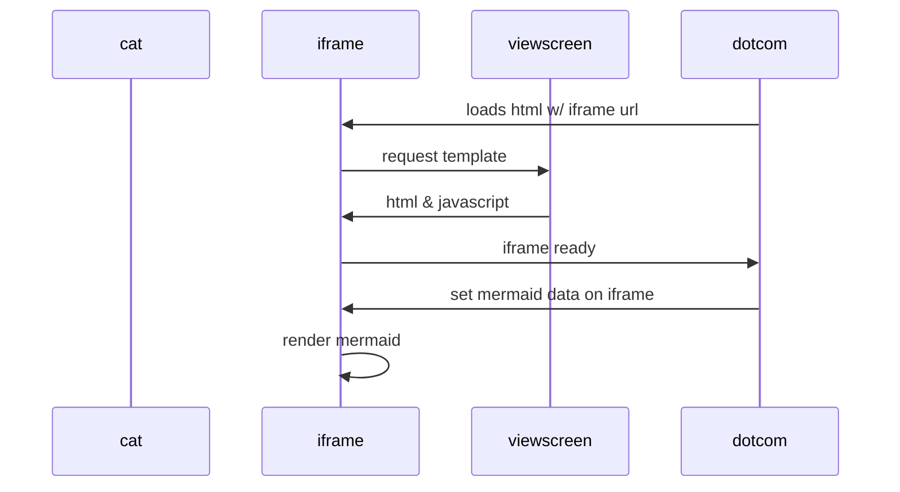

                                                   PRINTF

This project creates our own version of printf from the standard library. This is a group project from HolbertonSchool training


## Description
Printf instruction allows you to display on the screen the value of a variable, a label, the value of an expression, a character string, and this in various formats


## Charactère

| Charactère | description |  exemple
| --------| -----------|------
|%c|print a single character | H
|%i et %d | print an int convert to decimal | 9
|%%|print a percent sign| %
|%s|print a string of characters| HOLBERTON
|%f|print a floating-point number| 9,8
=======
Readme for printf
=======
____________________________________________________________________________
README
    for
p r i n t f
____________________________________________________________________________


un titre, le nom du projet ;
une description de ce que fait le plugin, sans trop entrer dans la technique ;
Les pré-requis à l’utilisation du plugin (version de node si besoin, dépendances, etc.)
le guide d’installation (les commandes à exécuter pour l’installation, les éventuels problèmes qui peuvent intervenir, etc.) ;
le guide d’utilisation : les méthodes, leurs options, ce qu’elles retournent, etc.
une roadmap, pour présenter ce que vous avez prévu pour le futur du plugin, avec d’éventuelles dates comme jalons ;
la licence d’utilisation, si vous voulez notamment limiter l’utilisation de votre plugin ;
les divers contributeurs, s’il y en a, ainsi qu’un moyen de les ou de vous contacter directement.
Également, il est recommandé d’inclure les éléments suivants dans votre README GitHub :

des images (y compris gif), si cela a du sens ;
divers liens, vers des vidéos de présentations, des exemples d’implémentation ;
des retours d’expériences, s’il y en a.


## Prototype

```bash
  int _printf(const char *format, ...)
```
This prototype defines a function called _printf which takes a format string as its first parameter and which can take a variable number of arguments (,...)

## Exemple
```bash
  int age;
  age = 25;
  _printf ( "I am %d years old\n", age )
```

displayed on screen --> I am 25 years old

```bash
  char *str;
  str =  Holberton
  _printf ( "My school is  %s\n", str )
```

displayed on screen -->  My school is Holberton

```bash
  char *str;
  char letter = C;
  str =  Holberton
  _printf ( "I have learn the language %c in %s\n", letter, str )
```

display on screen --> I have learn the language C in Holberton

## Organigramme
.png>)
=======
=======

---------------------------------------------------------------------------------

>>>>>>> 3234ed5 (man_3-printf)


