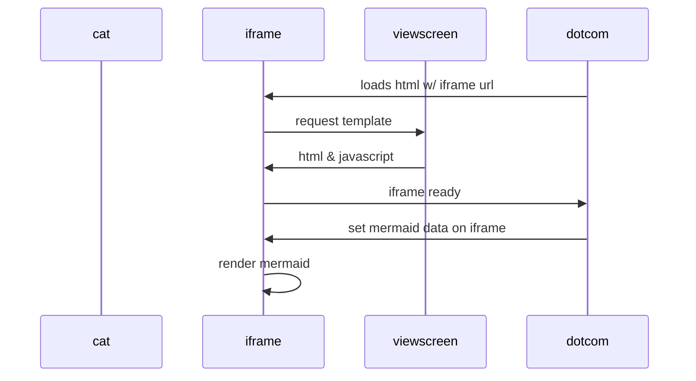

____________________________________________________________________________
README
    for
p r i n t f
____________________________________________________________________________

un titre, le nom du projet ;
une description de ce que fait le plugin, sans trop entrer dans la technique ;
Les pré-requis à l’utilisation du plugin (version de node si besoin, dépendances, etc.)
le guide d’installation (les commandes à exécuter pour l’installation, les éventuels problèmes qui peuvent intervenir, etc.) ;
le guide d’utilisation : les méthodes, leurs options, ce qu’elles retournent, etc.
une roadmap, pour présenter ce que vous avez prévu pour le futur du plugin, avec d’éventuelles dates comme jalons ;
la licence d’utilisation, si vous voulez notamment limiter l’utilisation de votre plugin ;
les divers contributeurs, s’il y en a, ainsi qu’un moyen de les ou de vous contacter directement.
Également, il est recommandé d’inclure les éléments suivants dans votre README GitHub :

des images (y compris gif), si cela a du sens ;
divers liens, vers des vidéos de présentations, des exemples d’implémentation ;
des retours d’expériences, s’il y en a.

---------------------------------------------------------------------------------

